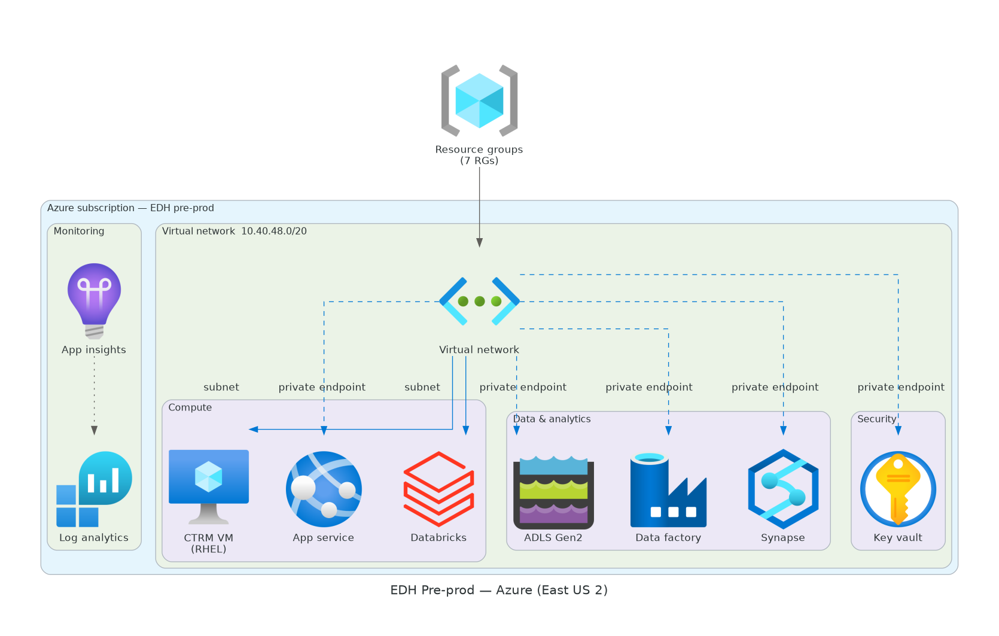
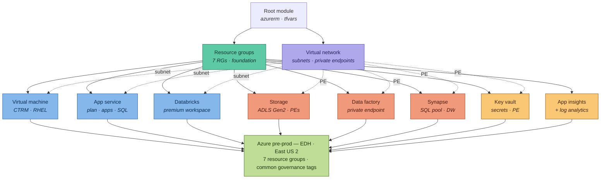
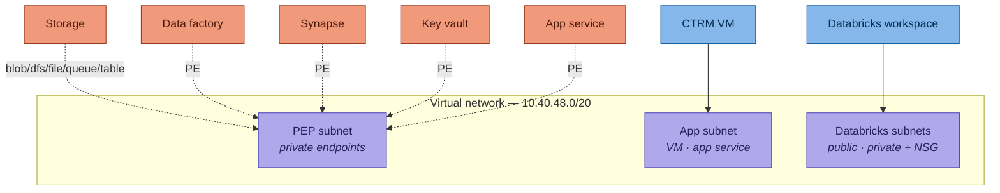

# Terraform Modules — EDH Pre-prod (Azure)

Terraform configuration that provisions the Azure infrastructure for the **Enterprise Data Hub (EDH)** **pre-prod** environment in the **East US 2** region. The stack is organised as a single root configuration that composes a set of reusable child modules, one per Azure service.

> This stack has been modernised to **Terraform 1.x** and the **azurerm 4.x** provider. All modules are active. See the [Modernisation](#modernisation) section for the full before → after of what changed.

---

## Table of contents

- [Architecture](#architecture)
- [Repository layout](#repository-layout)
- [Modules](#modules)
- [Prerequisites](#prerequisites)
- [Getting started](#getting-started)
- [Configuration](#configuration)
- [Tagging standard](#tagging-standard)
- [Networking model](#networking-model)
- [Outputs](#outputs)
- [Operational notes](#operational-notes)
- [Security](#security)
- [Troubleshooting](#troubleshooting)

---

## Architecture

The root module depends on the **resource groups** as its foundation. The **virtual network** supplies subnets to the compute tier (VM, App Service, Databricks) and terminates **private endpoints** for the PaaS data services (Storage, Data Factory, Synapse, Key Vault, App Service), giving them private-only network access.



*The diagram above is generated from `docs/architecture.py` (mingrammer Diagrams). Regenerate it after infra changes — see [Operational notes](#operational-notes).*

### Layered view



---

## Repository layout
```
Preprd/
├── main.tf # Root module — composes all child modules
├── variables.tf # Root input variable declarations
├── output.tf # Root outputs
├── provider.tf # azurerm provider + required_providers
├── backend.tf # Remote state backend (azurerm) configuration
├── demo.auto.tfvars # Variable values (auto-loaded)
├── .gitignore # Excludes state, .terraform/, .venv/
└── modules/
    ├── Resourcegroup/ # Resource groups (for_each)
    ├── Azurevnet/ # VNet, subnets, NSGs, delegations
    ├── VirtualMachine/ # CTRM Linux VMs (for_each) + KV secret
    ├── Azureappservice/ # App Service + SQL (mssql) + KV secret
    ├── azure-databricks-workspace/ # Databricks (VNet-injected)
    ├── StorageAccount/ # ADLS Gen2 + private endpoints (for_each)
    ├── Keyvault/ # Key Vault (RBAC)
    ├── Datafactory/ # Data Factory + managed identity + PE
    ├── AzureSynapseAnalytics/ # Synapse SQL (mssql) + KV secret + PE
    └── AppInsights/ # App Insights + Log Analytics

```
Each module contains `main.tf`, `variables.tf`, and `outputs.tf`; modules that read secrets also have a `data.tf`.
---

## Modules

| Module | Directory | Provisions | Depends on | Status |
|---|---|---|---|---|
| Resource groups | `Resourcegroup` | Creates the 7 pre-prod resource groups from a list | — | **Active** |
| Databricks | `azure-databricks-workspace` | Azure Databricks workspace (premium SKU), VNet-injected with NSGs & delegated subnets | Resource groups | **Active** |
| Virtual network | `Azurevnet` | Virtual network and subnets | Resource groups | **Active** |
| Virtual machine | `VirtualMachine` | CTRM Linux VMs (RHEL), NICs, OS & data disks | RGs, VNet (app subnet) |  **Active**  |
| App service | `Azureappservice` | App Service plan, web apps, and Azure SQL database | RGs, VNet (PE) | **Active** |
| Storage | `StorageAccount` | ADLS Gen2 account with private endpoints (blob, dfs, file, queue, table) | RGs, VNet (PE) | **Active**  |
| Data factory | `Datafactory` | Azure Data Factory with private endpoint | RGs, VNet (PE) | **Active** |
| Synapse | `AzureSynapseAnalytics` | Synapse SQL server + data warehouse / SQL pool + PE | RGs, VNet (PE) |**Active**   |
| Key vault | `Keyvault` | Key Vault (RBAC) with private endpoint | RGs, VNet (PE) | **Active** |
| App insights | `AppInsights` | Application Insights + Log Analytics workspace | Resource groups | **Active**  |

### Resource groups created

Defined as a list in `demo.auto.tfvars`:

| Resource group | Purpose |
|---|---|
| `rg-ads-eus2-edh-preprd-adf-005` | Data Factory |
| `rg-ads-eus2-edh-preprd-appin-005` | App Insights |
| `rg-ads-eus2-edh-preprd-appsvc-005` | App Service |
| `rg-ads-eus2-edh-preprd-ctrm-005` | CTRM virtual machines |
| `rg-ads-eus2-edh-preprd-dbx-005` | Databricks |
| `rg-ads-eus2-edh-preprd-dls2-005` | Data Lake Storage (ADLS Gen2) |
| `rg-ads-eus2-edh-preprd-syn-005` | Synapse Analytics |

---
## Prerequisites

- **Terraform** `>= 1.0` (declared in the root `terraform` block)
- **AzureRM provider** `~> 4.0`
- **Azure CLI** authenticated to the target subscription, or a service principal
- Permissions to create resource groups and the services below, including **private endpoints**, **subnet delegation**, and **Key Vault RBAC role assignments**
- An existing **Azure Key Vault** containing the SQL/VM admin secrets referenced by the VM, App Service, and Synapse modules (read at runtime via data sources)
- A **remote state backend** (Azure Storage account) if using the `backend.tf` configuration — see [State management](#state-management)

### Authentication

```bash
az login
az account set --subscription "<your-subscription-id>"
```

Ensure the required resource providers (e.g. `Microsoft.Databricks`, `Microsoft.Storage`, `Microsoft.Synapse`, `Microsoft.Sql`) are registered on the subscription.
---

## Getting started
- Note: the VM/App Service/Synapse modules read secrets from an existing Key Vault via data sources — those secrets must exist before apply
```bash
# 1. Move into the environment directory
cd Preprd

# 2. Initialise providers and modules
terraform init

# 3. Review the planned changes
terraform plan

# 4. Apply
terraform apply
```

Variable values are supplied automatically because the file is named `demo.auto.tfvars` (Terraform auto-loads any `*.auto.tfvars`). To override the file explicitly:

```bash
terraform plan  -var-file="demo.auto.tfvars"
terraform apply -var-file="demo.auto.tfvars"
```
---

## Configuration

Key root input variables (`variables.tf`):

| Variable | Type | Description |
|---|---|---|
| `resource-group` | `list` | Names of the resource groups to create |
| `location` | `string` | Azure region (e.g. `eastus`) |
| `AppId` | `string` | Governance tag — application identifier |
| `environment` | `string` | Governance tag — environment name |
| `DataClassification` | `string` | Governance tag — data sensitivity |
| `Role` | `string` | Governance tag — workload role |
| `SupportGroup` | `string` | Governance tag — owning support group |
| `databricksworkspace_name` | `string` | Databricks workspace name |
| `sku_premium` | `string` | Databricks SKU (e.g. `premium`) |
| `rgdbr` | `string` | Resource group for Databricks |

All modules are active; their variables are declared in the root `variables.tf` and supplied via `demo.auto.tfvars`. Complex inputs use typed maps — e.g. `subnets`, `virtual_machines`, `app_services`, and `storage_private_endpoints` are `map(object)` / `map(string)` structures.

---

## Tagging standard

Every resource is tagged with a consistent governance set, applied from the root variables:

| Tag | Example value |
|---|---|
| `AppId` | `TBD` |
| `environment` | `dev` |
| `DataClassification` | `CONFIDENTIAL` |
| `Role` | `Tools` |
| `SupportGroup` | `ADCS.Cloud.Infrastructure` |

The Databricks workspace additionally carries `application = databricks` and `databricks-environment = true`.

---

## Networking model

The virtual network uses the address space `10.40.48.0/20` and is segmented into subnets:

- **Private-endpoint (PEP) subnet** — hosts private endpoints for Storage (blob, dfs, file, queue, table), Data Factory, Synapse, Key Vault, and App Service, giving these PaaS services private-only access.
- **App subnet** — hosts the CTRM VM NICs (dynamic private IP) and App Service integration.
- **Databricks subnets** — a delegated public/private subnet pair, each associated with its own network security group (NSG).



---
## Outputs

Each module exposes outputs so the root can wire modules together without hardcoding
resource IDs — this is the basis of the loose-coupling design. Key module outputs:

| Module | Output | Used for |
|---|---|---|
| VNet | `vnet_id` | Databricks VNet injection |
| VNet | `subnet_ids` | Private endpoints and NIC placement (map of name → ID) |
| VNet | `subnet_names` | Databricks `custom_parameters` (map of key → name) |
| VNet | `nsg_association_ids` | Databricks injection (proves NSG associations exist) |
| Key Vault | `key_vault_id` | Downstream references |
| Storage | `storage_account_id`, `private_endpoint_ids` | Consumers of the storage account |
| Data Factory | `data_factory_id` | Downstream references |
| App Service | `app_service_ids`, `sql_server_id` | Downstream references |
| Synapse | `sql_server_id`, `sql_dw_id` | Downstream references |
| App Insights | `connection_string` (sensitive), `app_id` | App telemetry configuration |
| Databricks | `workspace_id`, `workspace_name` | Downstream references |

The root `output.tf` surfaces selected values after `apply` (e.g. the Databricks
workspace name and ID). Sensitive outputs such as the App Insights connection string
are marked `sensitive = true` so they are not printed in plan/apply output.

How loose coupling uses these: for example, the Data Factory module's private endpoint
subnet is wired as `module.application-vnet.subnet_ids["pep"]`, and Databricks consumes
`module.application-vnet.nsg_association_ids["databricks_public"]` — so no module
hardcodes another's resource paths.
---

## Operational notes

### Regenerating the architecture diagram

The PNG is produced from code so it stays in sync with the infrastructure:

```bash
pip install diagrams
# graphviz is required:  brew install graphviz   |   apt-get install graphviz
python docs/architecture.py      # -> docs/preprd_architecture.png
```

### State management

State is configured for a remote azurerm backend (see backend.tf). Provision the backend storage account, then run terraform init to initialise it.

---

## Security

Security practices applied in this configuration:

- **No secrets in code or state.** SQL and VM admin passwords are read at runtime from Azure Key Vault via `data` sources — no credential appears in `.tf` files or `demo.auto.tfvars`. (Sample credentials previously committed in the original repo have been rotated.)
- **Key Vault uses RBAC.** The vault is configured with `rbac_authorization_enabled`, granting access via scoped `azurerm_role_assignment` roles rather than the legacy access-policy model.
- **State is not committed.** `terraform.tfstate` files are excluded via `.gitignore`; a remote `azurerm` backend (Azure Storage) provides shared, locked, versioned state.
- **Storage is private by default.** The ADLS Gen2 account uses `network_rules { default_action = "Deny" }` with `bypass = ["AzureServices"]`, reachable only through its private endpoints.
- **Private endpoints throughout.** Storage, Data Factory, Synapse, App Service SQL, and Key Vault are reachable privately via endpoints in the PEP subnet rather than public internet.
- **Managed identities.** Data Factory uses a system-assigned managed identity for credential-free authentication to other services.

> **Note on git history:** secrets that were committed in the original repository remain in past commits. For a real deployment, rotate any exposed credentials and consider history-rewriting tools (e.g. `git filter-repo`) if the repo was ever public.

### Databricks VNet injection

The Databricks workspace was upgraded from a standard workspace to a **VNet-injected**
workspace, so its compute runs inside the project's virtual network rather than a
Microsoft-managed network. This required enabling several previously-commented pieces
and wiring them through the VNet module's outputs.

**What VNet injection needs, and why:**

- **Two subnets (public/host and private/container).** Databricks injection splits
  cluster networking by role. The private (container) subnet holds the actual compute
  — the cluster nodes running Spark workloads, locked down with no direct inbound
  internet. The public (host) subnet carries the VM host layer's outbound path to the
  Databricks control plane. The split isolates the data-processing workload from
  management/control traffic — different trust levels, different subnets. Both are
  mandatory for injection.

- **Subnet delegation.** Each Databricks subnet is delegated to
  `Microsoft.Databricks/workspaces` with the
  `Microsoft.Network/virtualNetworks/subnets/join/action` action. Delegation is an
  explicit, scoped grant that lets the Databricks service inject its managed compute
  NICs into the subnet — without it, Azure refuses to let the service manipulate the
  network. A delegated subnet becomes reserved for that service.

- **Network Security Groups (NSGs) and associations.** An NSG is a firewall rule list.
  It has no effect until *associated* with a subnet (or NIC) — the association is what
  applies the rules to traffic. Databricks requires each of its subnets to have an NSG
  associated, and its `custom_parameters` block references the **association IDs** (not
  just the subnet IDs) to prove the associations exist before the workspace injects.

**How it's wired (loose coupling):**

The VNet module owns all subnets, NSGs, and associations, and exposes them via outputs
(`subnet_ids`, `subnet_names`, `nsg_association_ids`). The Databricks module consumes
these outputs — `virtual_network_id`, the subnet names, and the NSG association IDs —
rather than hardcoding any network details. The subnet object type was extended with an
`optional()` delegation attribute and a `dynamic "delegation"` block, so only the
Databricks subnets carry delegation while `pep`/`app` remain plain.

### Why every resource is tagged

All resources carry a consistent five-tag governance set (`AppId`, `environment`,
`DataClassification`, `Role`, `SupportGroup`). Tags don't change how a resource
functions — their value is operational: **cost allocation** (Azure bills can be broken
down by tag, e.g. total spend per environment or application), **ownership** (who to
contact when a resource has issues), **governance/compliance** (policies can enforce
rules on, e.g., anything classified CONFIDENTIAL), and **automation** (scripts target
resources by tag). Applying the set to *every* resource avoids blind spots in cost
reports and governance queries.

Suggested `.gitignore` additions:

```gitignore
*.tfstate
*.tfstate.*
.terraform/
*.tfvars        # if they contain secrets; otherwise keep non-sensitive tfvars
crash.log
```

---

## Troubleshooting

| Symptom | Likely cause / fix |
|---|---|
| `Error: subscription is not registered to use namespace 'Microsoft.X'` | Provider registration is skipped — register the provider manually: `az provider register --namespace Microsoft.X` |
| Private endpoint creation fails | Ensure the PEP subnet exists and the deploying identity can create private endpoints; enable the `Azurevnet` module first |
| Databricks apply fails on subnet delegation | Ensure the delegated subnets and their NSG associations exist before the workspace applies (the module consumes nsg_association_ids) |
| Variable "not declared" errors after enabling a module | Ensure the variable is declared in both the root and module variables.tf and has a value in tfvars. |
| Diagram script fails with `dot: command not found` | Install Graphviz (`brew install graphviz` / `apt-get install graphviz`) |

---
## Modernisation
This repository was originally written ~5 years ago against Terraform 0.12 and
the azurerm 2.x provider. It has been modernised to current standards (Terraform
1.x, azurerm 4.x) with an emphasis on loose coupling, type safety, and secure
secret handling. The changes below are documented before → problem → after.
### Terraform & provider versions

**Before:** `required_version = ">= 0.12"`, azurerm pinned as `version = ">= 2.0.0"`
inside the provider block (the deprecated style).

**Problem:** An open lower-bound constraint (`>= 2.0.0`) allows major-version jumps
that carry breaking changes, so a routine `init` could silently pull an incompatible
provider. The `version` argument in the provider block is also the legacy location.

**After:** Declared providers in a `required_providers` block with a pessimistic
constraint (`azurerm = "~> 4.0"`, i.e. >= 4.0 and < 5.0), and set
`required_version = ">= 1.0"`. This guarantees reproducible, non-breaking upgrades.
The provider block is now minimal (`features {}`), dropping redundant settings.


### Remote state backend

**Before:** State stored locally in `terraform.tfstate` (committed to the repo).

**Problem:** Local state can't be shared across a team, offers no locking (risking
state corruption on concurrent applies), and often contains secrets.

**After:** Added an `azurerm` backend configuration storing state in an Azure Storage
Account, which provides shared access and automatic state locking. State files are
keyed per environment (`preprd.terraform.tfstate`) to keep environments isolated.

### `count` → `for_each` for resource groups

**Before:** The resource-group module created its 7 RGs with `count` over a list,
tracking each by list index (`[0]`, `[1]`, ...).

**Problem:** Index-based tracking means removing an item from the middle of the
list shifts every later item down a position, causing Terraform to destroy and
recreate unrelated resource groups.

**After:** Converted to `for_each` over `toset(var.resource-group)`, so each RG is
tracked by its unique name as a stable key. Adding or removing one RG now affects
only that RG, leaving the others untouched.

### Databricks workspace

**Before:** Workspace created without an explicit managed resource group name, and
pinned to older version constraints.

**After:** Added `managed_resource_group_name` following the project naming
convention, so the Databricks-owned backing resource group (holding the cluster
VMs, storage, and VNet) is named consistently rather than auto-generated. Verified
the workspace resource against azurerm 4.x (core arguments unchanged) and updated
version constraints.

### VNet module rewrite (for_each over a typed map)

**Before:** Three near-identical `azurerm_subnet` blocks copy-pasted.

**Problem:** All three reused the same `subnet_name1` variable (so subnets would
collide on name), and two referenced `address_prefixes_sub2/3` variables that were
never declared. The blocks also used 2.x subnet syntax removed in 4.x.

**After:** Rewrote as a single `for_each` over a `map(object({...}))` of subnet
definitions, giving each subnet a unique name and non-overlapping CIDR. The typed
object constraint documents and enforces the shape of each subnet entry. Migrated to
4.x syntax: `address_prefixes` (list, was singular `address_prefix`) and
`private_endpoint_network_policies` (string enum, was the removed bool
`enforce_private_link_endpoint_network_policies`).

### Key Vault: access policies → RBAC

**Before:** Key Vault used the legacy access-policy model with per-operation
permission lists (`key_permissions`, `secret_permissions`).

**Problem:** Access policies are a Key-Vault-specific permission system, separate
from the rest of Azure IAM, and must be managed per-vault. Microsoft now recommends
RBAC for new vaults.

**After:** Enabled RBAC authorization (`rbac_authorization_enabled = true` — note the
older `enable_rbac_authorization` is deprecated in 4.x and removed in 5.x) and grant
data-plane access via scoped `azurerm_role_assignment` resources using standard roles
(e.g. Key Vault Administrator). This unifies vault access with Azure's IAM model and
supports scope inheritance.

### Secrets handling

**Before:** VM and Synapse admin passwords stored in plaintext in `demo.auto.tfvars`,
committed to the repository.

**Problem:** Committed secrets are exposed to anyone with repo access and persist in
git history even after removal.

**After:** Removed plaintext credentials. Secret variables are marked `sensitive = true`;
the intended pattern reads secrets at runtime from Azure Key Vault via data sources, so
credentials never enter version control. (Sample credentials that were previously
committed have been rotated.)

### Loose coupling via module outputs

**Before:** Consumer modules received full hardcoded subnet resource IDs as input
variables (e.g. `kvsubnet_id = "/subscriptions/.../subnets/..."`).

**Problem:** Hardcoded resource paths couple every module to a specific VNet layout;
any change means hand-editing paths in multiple places.

**After:** The VNet module exposes a `subnet_ids` output (a map of logical name → ID)
and the Key Vault module exposes its vault ID. The root wires modules together by
referencing these outputs, so no module hardcodes another's internals. 
The Key Vault module's private endpoint was initially decoupled to keep the vault
independently deployable, then wired back once the VNet was available, consuming
`module.application-vnet.subnet_ids["pep"]` like the other private endpoints.

### App Insights: connection string over instrumentation key

**Before:** The module output the Application Insights `instrumentation_key` and
hardcoded a 30-day retention.

**After:** Switched the output to `connection_string` (the instrumentation key is
legacy; Microsoft now recommends connection-string-based telemetry) and marked it
`sensitive`. Made retention configurable via a typed variable, and added type
constraints to the remaining variables. The workspace-linked App Insights pattern
(via `workspace_id`) was already current and retained.

### Data Factory: loose-coupled private endpoint + managed identity

**Before:** The Data Factory resource had no tags (they were inside a commented-out
block), the module carried hardcoded principal/tenant IDs and Azure DevOps URLs in a
commented `identity`/`github_configuration` block, and the private endpoint took a
hardcoded 200-character subnet path via `dfacsubnet_id`.

**After:** Added a clean `identity { type = "SystemAssigned" }` (Azure generates the
IDs — none hardcoded) so the factory can authenticate to other services without stored
credentials, and added governance tags to the factory itself. The private endpoint's
subnet ID now comes from the VNet module's `subnet_ids["pep"]` output rather than a
hardcoded path — the first consumer of the loose-coupling pattern.

### Storage (ADLS Gen2): DRY private endpoints + security hardening

**Before:** Five near-identical `azurerm_private_endpoint` blocks (blob, dfs, file,
queue, table), the storage account used 2.x argument names, and `network_rules` had
`default_action = "Allow"`.

**Problem:** `default_action = "Allow"` accepts public traffic by default, defeating the
purpose of the private endpoints. The 2.x arguments are removed in 4.x. Five copy-pasted
blocks are error-prone to maintain.

**After:** Collapsed the five endpoints into a single `for_each` over a
`map(string)` of sub-resource type → endpoint name. Migrated renamed arguments
(`enable_https_traffic_only` → `https_traffic_only_enabled`,
`allow_blob_public_access` → `allow_nested_items_to_be_public`) and hardened the
network rules to `default_action = "Deny"` with `bypass = ["AzureServices"]`, so the
account is reachable only through its private endpoints. Wired the PEP subnet from the
VNet output (loose coupling) and added outputs.


### Virtual Machine (CTRM): modern VM resource + Key Vault secrets + DRY

**Before:** Two near-identical VMs built with the deprecated `azurerm_virtual_machine`
resource (with nested `os_profile`, `storage_os_disk`, `storage_image_reference`
blocks), duplicated across ~8 resources (2 VMs, 2 NICs, 2 disks, 2 attachments). The
admin password was partly wired to a Key Vault data source but with hardcoded vault
and secret names.

**After:** Migrated to the modern `azurerm_linux_virtual_machine` resource
(top-level `admin_password`, `os_disk`, `source_image_reference`,
`disable_password_authentication`). Collapsed all eight resources into four `for_each`
blocks over a typed `map(object)` of VM definitions, paired by key so each VM aligns
with its NIC and data disk. The admin password is read at runtime from Key Vault via
data sources (vault and secret names now variables) — no credential ever appears in
code or tfvars. NIC subnet comes from the VNet `subnet_ids["app"]` output.
Migrated 4.x disk args (`zone` string, numeric `disk_size_gb`/`lun`) and removed
the pile of now-unused per-VM variables absorbed by the map.


### App Service (+ SQL): full 4.x resource rewrites + Key Vault secret

**Before:** Used four deprecated/removed resources — `azurerm_app_service_plan`
(with `sku{}`/`kind`/`reserved`), two `azurerm_app_service` blocks (with a
`site_config` that set php/python/dotnet/linux_fx versions simultaneously),
`azurerm_sql_server` (with a hardcoded plaintext admin password), and
`azurerm_sql_database` (using `requested_service_objective_name`/`server_name`).

**After:** Migrated to the current resources: `azurerm_service_plan` (flat
`os_type`/`sku_name`), `azurerm_linux_web_app` with runtime set via a single
`application_stack` block (the old multi-runtime config was invalid), and
`azurerm_mssql_server` / `azurerm_mssql_database` (using `server_id` and `sku_name`).
Collapsed the two web apps into one `for_each`. Renamed 4.x arguments
(`client_certificate_enabled`). The SQL admin password is now read from Key Vault via
a data source — the hardcoded credential was removed entirely. SQL private endpoint
subnet comes from the VNet output.

### Synapse Analytics: mssql migration + Key Vault secret

**Before:** Used `azurerm_sql_server` (with a plaintext admin password variable) and
`azurerm_sql_database` with `edition = "DataWarehouse"` +
`requested_service_objective_name = "DW100c"`.

**After:** Migrated to `azurerm_mssql_server` and `azurerm_mssql_database`, where the
data warehouse is expressed via `sku_name = "DW100c"` and `server_id` (replacing the
separate edition/objective/server_name arguments). The SQL admin password is read from
Key Vault via a data source — the plaintext credential was removed. Private endpoint
subnet comes from the VNet output.

### Known future improvements
- Add a private DNS zone (`privatelink.*`) alongside each private endpoint so hostnames
  resolve to private IPs automatically.
- Add outputs to the Resource Group module (a map of name → ID) and have consumer
  modules reference them, so every module's resource group is guaranteed to be one
  this stack creates rather than an independently-supplied name.
- Update the architecture diagram (`docs/architecture.py`) to show the Databricks
  public/private subnet pair, their NSGs, and subnet delegation. The current PNG is a
  service-level overview; the network detail lives in the [Networking model](#networking-model)
  section for now.
## License

Add your license here (e.g. MIT). No license file is currently present in the repository.
