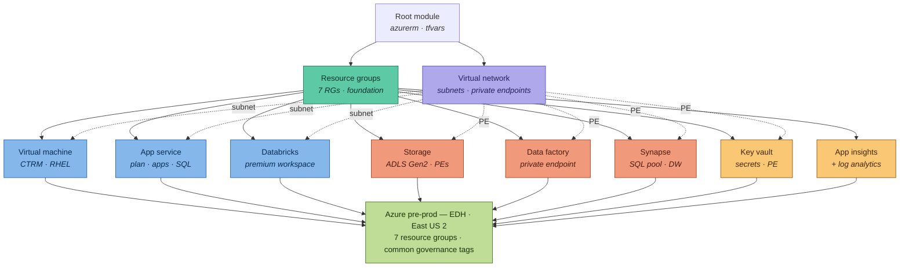
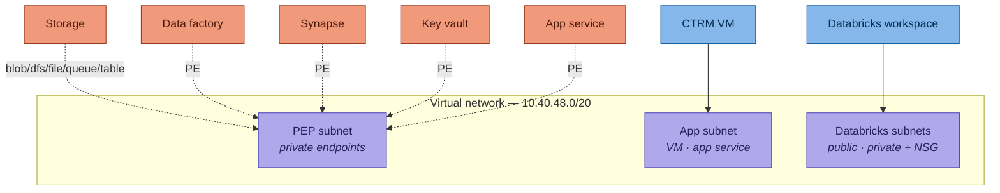

# Terraform Modules — EDH Pre-prod (Azure)

Terraform configuration that provisions the Azure infrastructure for the **Enterprise Data Hub (EDH)** **pre-prod** environment in the **East US 2** region. The stack is organised as a single root configuration that composes a set of reusable child modules, one per Azure service.

> **Heads-up on repo state:** In the committed `main.tf`, only the **Resource Group** and **Databricks Workspace** modules are active. The other modules (VNet, Virtual Machine, App Service, App Insights, Storage, Key Vault, Data Factory, Synapse) are fully written but **commented out** — enable them by uncommenting the module block and the corresponding variables. This README documents the **complete intended architecture** (all modules), with the current status noted per module.

---

## Table of contents

- [Architecture](#architecture)
- [Repository layout](#repository-layout)
- [Modules](#modules)
- [Prerequisites](#prerequisites)
- [Getting started](#getting-started)
- [Configuration](#configuration)
- [Tagging standard](#tagging-standard)
- [Networking model](#networking-model)
- [Outputs](#outputs)
- [Operational notes](#operational-notes)
- [Security](#security)
- [Troubleshooting](#troubleshooting)

---

## Architecture

The root module depends on the **resource groups** as its foundation. The **virtual network** supplies subnets to the compute tier (VM, App Service, Databricks) and terminates **private endpoints** for the PaaS data services (Storage, Data Factory, Synapse, Key Vault, App Service), giving them private-only network access.


*The diagram above is generated from `docs/architecture.py` (mingrammer Diagrams). Regenerate it after infra changes — see [Operational notes](#operational-notes).*

### Layered view



---

## Repository layout

```
Preprd/
├── main.tf                 # Root module — composes all child modules
├── variables.tf            # Root input variable declarations
├── output.tf               # Root outputs (Databricks outputs, currently commented)
├── provider.tf             # azurerm provider configuration
├── demo.auto.tfvars        # Variable values (auto-loaded)
├── terraform.tfstate       # State file (see Security note)
├── terraform.tfstate.backup
└── modules/
    ├── Resourcegroup/            # Resource groups
    ├── Azurevnet/               # Virtual network + subnets
    ├── VirtualMachine/          # CTRM Linux VMs
    ├── Azureappservice/         # App Service plan, apps, SQL
    ├── azure-databricks-workspace/  # Databricks workspace
    ├── StorageAccount/          # ADLS Gen2 + private endpoints
    ├── Keyvault/                # Key Vault
    ├── Datafactory/             # Azure Data Factory
    ├── AzureSynapseAnalytics/   # Synapse SQL pool / DW
    └── AppInsights/             # App Insights + Log Analytics
```

Each module folder follows the standard convention: `main.tf` (resources), `variable.tf` / `variables.tf` (inputs), and `output.tf` / `outputs.tf` (outputs) where applicable.

---

## Modules

| Module | Directory | Provisions | Depends on | Status |
|---|---|---|---|---|
| Resource groups | `Resourcegroup` | Creates the 7 pre-prod resource groups from a list | — | **Active** |
| Databricks | `azure-databricks-workspace` | Azure Databricks workspace (premium SKU); NSGs & delegated subnets available | Resource groups | **Active** |
| Virtual network | `Azurevnet` | Virtual network and subnets | Resource groups | Commented out |
| Virtual machine | `VirtualMachine` | CTRM Linux VMs (RHEL), NICs, OS & data disks | RGs, VNet (app subnet) | Commented out |
| App service | `Azureappservice` | App Service plan, web apps, and Azure SQL database | RGs, VNet (PE) | Commented out |
| Storage | `StorageAccount` | ADLS Gen2 account with private endpoints (blob, dfs, file, queue, table) | RGs, VNet (PE) | Commented out |
| Data factory | `Datafactory` | Azure Data Factory with private endpoint | RGs, VNet (PE) | Commented out |
| Synapse | `AzureSynapseAnalytics` | Synapse SQL server + data warehouse / SQL pool + PE | RGs, VNet (PE) | Commented out |
| Key vault | `Keyvault` | Key Vault with access policies and private endpoint | RGs, VNet (PE) | Commented out |
| App insights | `AppInsights` | Application Insights + Log Analytics workspace | Resource groups | Commented out |

### Resource groups created

Defined as a list in `demo.auto.tfvars`:

| Resource group | Purpose |
|---|---|
| `rg-ads-eus2-edh-preprd-adf-005` | Data Factory |
| `rg-ads-eus2-edh-preprd-appin-005` | App Insights |
| `rg-ads-eus2-edh-preprd-appsvc-005` | App Service |
| `rg-ads-eus2-edh-preprd-ctrm-005` | CTRM virtual machines |
| `rg-ads-eus2-edh-preprd-dbx-005` | Databricks |
| `rg-ads-eus2-edh-preprd-dls2-005` | Data Lake Storage (ADLS Gen2) |
| `rg-ads-eus2-edh-preprd-syn-005` | Synapse Analytics |

---

## Prerequisites

- **Terraform** `>= 0.12` (root modules declare `required_version = ">= 0.12"`)
- **AzureRM provider** `>= 2.0.0`
- **Azure CLI** authenticated to the target subscription, or a service principal
- Permissions to create resource groups and the above services in the subscription
- A user/service principal with rights to create **private endpoints** and manage **Key Vault access policies** (when those modules are enabled)

### Authentication

Authenticate with the Azure CLI before running Terraform:

```bash
az login
az account set --subscription "<your-subscription-id>"
```

The provider is configured with `skip_provider_registration = true`, so ensure the required resource providers (e.g. `Microsoft.Databricks`, `Microsoft.Storage`, `Microsoft.Synapse`) are already registered on the subscription.

---

## Getting started

```bash
# 1. Move into the environment directory
cd Preprd

# 2. Initialise providers and modules
terraform init

# 3. Review the planned changes
terraform plan

# 4. Apply
terraform apply
```

Variable values are supplied automatically because the file is named `demo.auto.tfvars` (Terraform auto-loads any `*.auto.tfvars`). To override the file explicitly:

```bash
terraform plan  -var-file="demo.auto.tfvars"
terraform apply -var-file="demo.auto.tfvars"
```

### Enabling additional modules

To turn on a module that is currently commented out:

1. Uncomment its `module "..." { ... }` block in `main.tf`.
2. Uncomment the matching variable declarations in `variables.tf`.
3. Confirm the values exist in `demo.auto.tfvars`.
4. Run `terraform plan` to validate before applying.

---

## Configuration

Key root input variables (`variables.tf`):

| Variable | Type | Description |
|---|---|---|
| `resource-group` | `list` | Names of the resource groups to create |
| `location` | `string` | Azure region (e.g. `eastus`) |
| `AppId` | `string` | Governance tag — application identifier |
| `environment` | `string` | Governance tag — environment name |
| `DataClassification` | `string` | Governance tag — data sensitivity |
| `Role` | `string` | Governance tag — workload role |
| `SupportGroup` | `string` | Governance tag — owning support group |
| `databricksworkspace_name` | `string` | Databricks workspace name |
| `sku_premium` | `string` | Databricks SKU (e.g. `premium`) |
| `rgdbr` | `string` | Resource group for Databricks |

Additional variables for the other modules (VM, App Service, Storage, Key Vault, Data Factory, Synapse) are declared but commented out; uncomment as you enable each module.

---

## Tagging standard

Every resource is tagged with a consistent governance set, applied from the root variables:

| Tag | Example value |
|---|---|
| `AppId` | `TBD` |
| `environment` | `dev` |
| `DataClassification` | `CONFIDENTIAL` |
| `Role` | `Tools` |
| `SupportGroup` | `ADCS.Cloud.Infrastructure` |

The Databricks workspace additionally carries `application = databricks` and `databricks-environment = true`.

---

## Networking model

The virtual network uses the address space `10.40.48.0/20` and is segmented into subnets:

- **Private-endpoint (PEP) subnet** — hosts private endpoints for Storage (blob, dfs, file, queue, table), Data Factory, Synapse, Key Vault, and App Service, giving these PaaS services private-only access.
- **App subnet** — hosts the CTRM VM NICs (dynamic private IP) and App Service integration.
- **Databricks subnets** — a delegated public/private subnet pair, each associated with its own network security group (NSG).



---

## Outputs

Root outputs are defined in `output.tf` but currently commented out. When enabled, the Databricks module exposes:

| Output | Description |
|---|---|
| `workspace_name` | Name of the Databricks workspace |
| `workspace_id` | ID of the Databricks workspace |
| `security_group_private_name` / `_id` | NSG assigned to the private subnet |
| `security_group_public_name` / `_id` | NSG assigned to the public subnet |

Uncomment the relevant `output` blocks (and ensure the module actually exports those values) to surface them after `apply`.

---

## Operational notes

### Regenerating the architecture diagram

The PNG is produced from code so it stays in sync with the infrastructure:

```bash
pip install diagrams
# graphviz is required:  brew install graphviz   |   apt-get install graphviz
python docs/architecture.py      # -> docs/preprd_architecture.png
```

### State management

State is currently stored locally (`terraform.tfstate`). For team use, migrate to a remote backend (e.g. an Azure Storage account) so state is shared, locked, and versioned. Add a `backend "azurerm" { ... }` block to the Terraform configuration and run `terraform init -migrate-state`.

---

## Security

> **Action required.** The following issues exist in the current repository and should be addressed:

- **Plaintext credentials in `demo.auto.tfvars`.** VM admin passwords and the Synapse SQL login/password are committed in cleartext. Treat them as compromised, rotate them, and move secrets to **Key Vault** or environment variables (`TF_VAR_*`) instead of committing them.
- **State files are committed.** `terraform.tfstate` and its backup are in version control. State can contain secrets and resource identifiers — remove them from the repo, add them to `.gitignore`, and use a remote backend.
- **Least privilege.** Scope the deploying identity to only the permissions required for these resource groups.

Suggested `.gitignore` additions:

```gitignore
*.tfstate
*.tfstate.*
.terraform/
*.tfvars        # if they contain secrets; otherwise keep non-sensitive tfvars
crash.log
```

---

## Troubleshooting

| Symptom | Likely cause / fix |
|---|---|
| `Error: subscription is not registered to use namespace 'Microsoft.X'` | Provider registration is skipped — register the provider manually: `az provider register --namespace Microsoft.X` |
| Private endpoint creation fails | Ensure the PEP subnet exists and the deploying identity can create private endpoints; enable the `Azurevnet` module first |
| Databricks apply fails on subnet delegation | Uncomment and configure the NSG + delegated subnet blocks in the Databricks module |
| Variable "not declared" errors after enabling a module | Uncomment the matching variable declarations in `variables.tf` |
| Diagram script fails with `dot: command not found` | Install Graphviz (`brew install graphviz` / `apt-get install graphviz`) |

---

## License

Add your license here (e.g. MIT). No license file is currently present in the repository.
